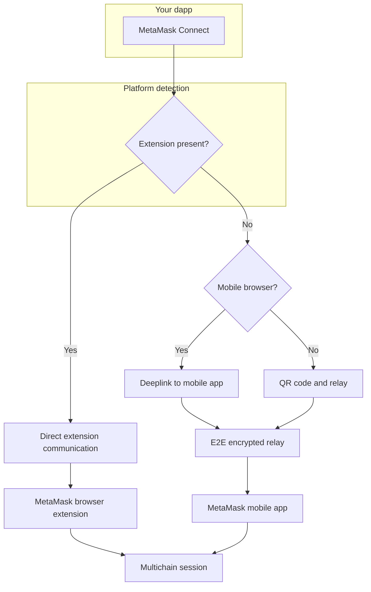

# Architecture

MetaMask Connect manages the full connection lifecycle between your dapp and the MetaMask wallet. It detects the user's platform, selects the best transport (direct extension, QR code relay, or deeplink), creates an encrypted CAIP-25 session, and persists that session across page reloads. All relay traffic is end-to-end encrypted so the relay server never sees message content.

When a user connects, MetaMask Connect automatically handles the following:

1. **Platform detection**: Checks for the MetaMask extension, browser type, and device.
2. **Transport selection**: Connects directly to the extension, or falls back to a QR code or deeplink relay.
3. **Session creation**: Establishes a [CAIP-25](https://github.com/ChainAgnostic/CAIPs/blob/main/CAIPs/caip-25.md) session for the requested chains.
4. **End-to-end encryption**: Encrypts relay connections so the relay server never sees message content.
5. **Session persistence**: Preserves sessions across page reloads and new tabs.

The following diagram illustrates this:

## Next steps

- [Explore integration options.](./integration-options.md)
- [View supported platforms and connection methods.](./supported-platforms.md)
- [Get started with EVM networks.](./evm/index.md)
